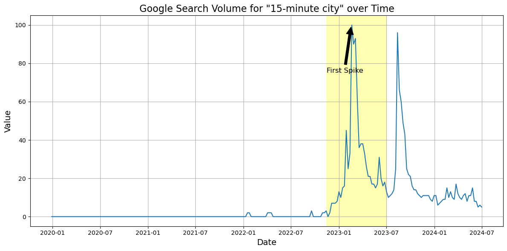

<!--- paginate: skip --->

# Project Presentation
## Social Media Data Science
Julia King
University of Konstanz
2024-07-03

---
<!--- paginate: true --->

# Research question and motivation

- track emergence of conspiracy around 15-minute cities on YouTube
- show effect on search results & engagement metrics

## Hypotheses

1. first spike in public interest -> % of conspirative videos increases

2. conspirative videos -> comments more negative

3. video is conspirative -> higher engagement rates per view

---

# Data and methods

1. google trends -> determine spikes in public interest

2. youtube api -> data & comments of most-viewed videos per week

3. by hand -> classify sample of videos as conspirative / non-conspirative

4. supervised text analysis -> classify complete dataset & evaluate

5. LEIA -> obtain sentiments of comments

6. Statistical analysis

---

# Results

---

# Conclusion and critique

- google trends shows clear spike -> useful cutoff point
- heavy use of YouTube API -> data retrieval needs scheduling
- second spike unexpected -> potentially counters trend?

## Thank you for listening!

<!--- Style & Formatting --->
<!--- reformat page numbers to include total --->
